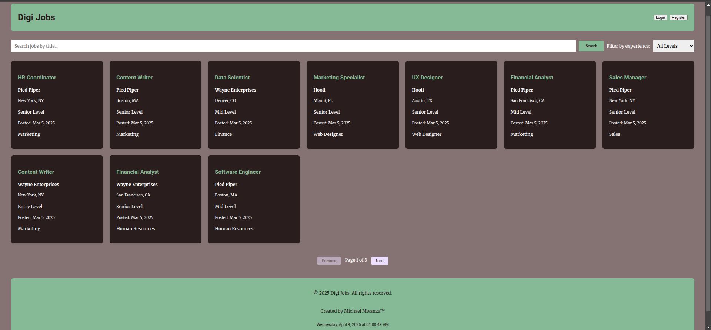

# Digi Jobs - Job Board Application



## Table of Contents

- [Features](#features)
- [API Routes](#api-routes)
- [Installation](#installation)
- [Usage](#usage)
- [Authentication](#authentication)
- [Application Flow](#application-flow)
- [Technologies Used](#technologies-used)
- [Future Enhancements](#future-enhancements)

## Features

- **Job Search**: Search jobs by title using the API endpoint
- **Filtering**: Filter jobs by experience level (Entry, Mid, Senior)
- **Pagination**: Browse through job listings with pagination
- **User Authentication**: Register and login system
- **Job Applications**: Submit applications for jobs
- **Admin Features**: Download user data as CSV
- **Responsive Design**: Works on mobile and desktop devices
- **Real-time Clock**: Displays current date and time in footer

## video url: https://youtu.be/y8fKGOXfuco

## API Routes

The application uses the following API endpoints:

| Endpoint                                                 | Method | Description          | Parameters                 |
| -------------------------------------------------------- | ------ | -------------------- | -------------------------- |
| `/api/jobs/`                                             | GET    | Get all jobs         | `page`, `experience_level` |
| `/api/jobs/?title={query}`                               | GET    | Search jobs by title | `title`, `page`            |
| (More endpoints can be added here as you expand the API) |

## Installation

1. Clone the repository:
   ```bash
   git clone https://github.com/yourusername/digi-jobs.git
   cd digi-jobs
   ```

Open the project in your preferred code editor

Launch the application:

Simply open index.html in a web browser

Or use a local development server like Live Server (VS Code extension)

Usage
For Job Seekers
Browse available jobs on the main page

Use the search bar to find specific jobs by title

Filter by experience level using the dropdown

Click on a job card to view details

Click "Apply Now" to submit an application

For Employers/Admins
Register an account using the "Register" button

Log in to access admin features

Download user data as CSV using the "Download Users" button

Authentication
The app includes a simple authentication system:

Registration:

Requires name, email, password, and experience level

Stores users in localStorage

Login:

Requires email and password

Successful login enables admin features

Logout:

Click the "Logout" button (replaces Login button when logged in)

Application Flow
Initial Load:

Fetches and displays first page of jobs

Shows authentication buttons

Searching:

User enters search term

App queries /api/jobs/?title={query}

Displays matching results

Filtering:

User selects experience level

App adds experience_level parameter to API call

Updates displayed jobs

Pagination:

User navigates through pages

App updates page parameter in API call

Application Process:

User views job details

Submits application form

Application stored in localStorage

Technologies Used
Frontend:

HTML5, CSS3, JavaScript (ES6+)

Responsive design with CSS Grid and Flexbox

Google Fonts (Merriweather and Roboto)

API:

Custom API hosted at https://michaelmwanza.site/api

Storage:

localStorage for user data and applications

Future Enhancements
Backend Integration:

Connect to a proper database

Implement server-side authentication

Additional Features:

Job posting functionality for employers

User profiles with application history

Email notifications for new jobs/applications

Enhanced UI:

Loading animations

More detailed job cards

Advanced search filters

API Expansion:

Endpoint for submitting new jobs

Endpoint for managing applications

Endpoint for user profile data
